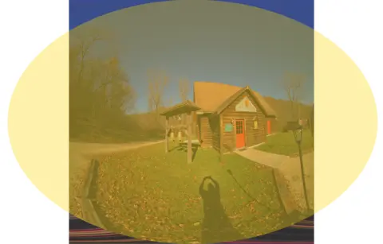

## Figuring out the geometry of the side by side captured image

**Image format**
Vertically compressed fisheye with an output square image so it's an oval touching the left and right edges and 350px above and below the oval.

**Procedure**
1. Crop the left side of the image (could be either side)

  If you need dual fisheye, you'll need to make a few changes, but the same vertical stretching and copping principles apply.

2. Stretch image to make fisheye into a perfect circle

   This requires anamorphically stretching to 3840 (don't change width) x 4540 (3840 + 350 + 350)
3. Crop the image back to 3840x3840 by the center

    This takes off the wasted pixels leaving a circle behind.

4. Using a circular mask, remove the outer edges. Software shouldn't care, but if you are attempting feature matching, the edges may cause an issue.

**Convert to equirectangular using ffmpeg**
I hate that it's very complicated to change projection in ImageMagick (that I could find). Ffmpeg is typically used for audio and/or video, but will work fine on images too.

Use the `v360` filter.  Set input to `fisheye` and output to `hequirect`.

## Now, with pictures
### How not to dewarp to fisheye
1. If we look at the curvature at the top and the bottom of the image, we can extend it out to create an oval. Of course, this goes beyond the bounds of the image.

   

2. If we simply stretch the oval so its sides align with the original square shape, obviously we have empty space.

   

3. We can then stretch the top and bottom of the oval to the top and bottom of the original square to complete the reprojection, but clearly this isn't a good path to follow.

   

### Maybe how to dewarp to fisheye, and beyond
1. Starting with the same oval from #1 above, we can stretch it to the top and bottom of the original square. This appears better, although hard to say without a checkerboard sort of image to look at.

   

2. Now instead of further distorting anything, we can simply look at the circular region enclosed within the square. We have some usable image around the edges, but we also have the waste in the corners. I believe that the documentation states 185°, not 180°, so this is likely the extra pixels.

   

3. If we simply use the circle as a mask, we now have a round image that I believe is a proper fisheye.

   

4. Final step. Use ffmpeg to go from fisheye to equirectangular (or equisquare?). It looks like ImageMagick should be able to do it but I gave up figuring it out.

   

In the end, how you convert your images depends on what you're doing with them. Some apps might only know how to work with fisheye or only know equirectangular. Obviously this loses the stereo effect, but you can modify the scripts accordingly to address that.